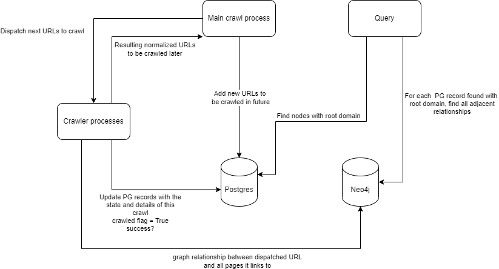
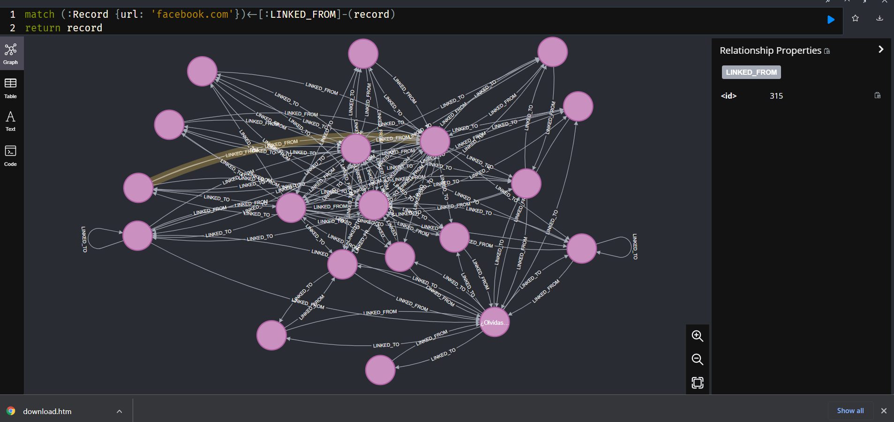

# Web crawler to understand links between domains
## Why?
SEO can be tricky. I'm interested in what role cross-linking may have
in the SEO space. Have a competitor that seems to always be placed higher
in rankings than you? This may help you understand where people are linking
to your site vs theirs which can help you push where you focus effort on
advertising to try to boost your rank.

## Why did I choose this project?
TL;DR: I'm interested in de-mystifying the role of cross-linking in SEO
ranking algorithm.

SEO is kind of a black-box to us. Understanding one of the more complicated
points of cross-linking may give me a better understanding as to how much of
a role this plays in current algorithms.

All in all spent about 6.5 hours on the
project, spending some time periodically throughout the weekend writing
it up.

## Current architecture:


# Instructions:
Setup database services:
```sh
$ docker-compose up postgres neo4j
```

Run crawler to seed data. I recommend running with > 8 workers
```sh
$ docker-compose run app -crawl --workers=16
```

Now that you have data populated, you can query the data to see
who links to a given domain

```sh
$ docker-compose run app -query --domain=facebook.com
```

Results should resemble
```
Breakdown of connections from different root domains for facebook.com

From Domain          Number of links to this domain
-----------------  --------------------------------
www.messenger.com                                11
messenger.com                                     1
```

# Visualizing graph
If you go to `localhost:7474` in a browser, you can use neo4j
web interface to visualize data.

An example query for links to/from facebook is
```
match (:Record {url: 'facebook.com'})<-[:LINKED_FROM]-(record)
return record
```

You can click on the "graph" tab to see something like this:
